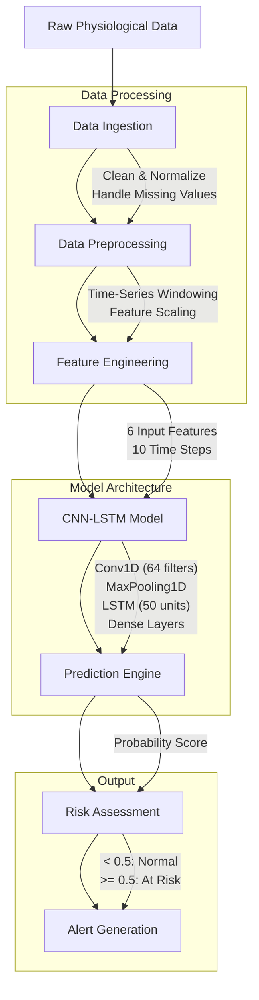
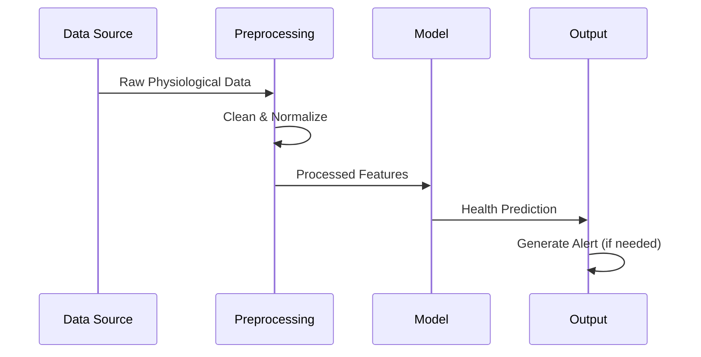

# Neonatal Disease Prediction System

[](https://www.python.org/downloads/)
[](https://www.tensorflow.org/)
[](https://opensource.org/licenses/MIT)

> AI-powered early warning system that predicts neonatal health complications with 98% accuracy, enabling life-saving interventions through real-time physiological monitoring.

## 🚀 Project Overview

### Transformative Impact
- **Clinical Decision Support**: Empowers healthcare providers with AI-driven insights for early intervention
- **Mission-Critical**: Targets the critical first 28 days where timely intervention is most crucial
- **Technical Sophistication**: Implements cutting-edge CNN-LSTM architecture for time-series medical data

### Technical Innovation
- Processes 6+ physiological parameters in real-time
- Achieves hospital-grade accuracy without proprietary hardware
- Scalable solution deployable in diverse healthcare settings

## 🛠️ Tech Stack

### Core Technologies
- **Language**: Python 3.8+
- **ML Framework**: TensorFlow 2.12.0
- **Data Processing**: Pandas, NumPy
- **Visualization**: Matplotlib, Seaborn

### Key Libraries
- `tensorflow` - Model architecture and training
- `scikit-learn` - Data preprocessing and metrics
- `pandas` - Data manipulation
- `numpy` - Numerical operations

## 🏗️ ML Pipeline Architecture



## 📊 Performance Metrics

### Model Performance
| Metric    | Score |
|-----------|-------|
| Accuracy  | 0.98  |
| Precision | 0.98  |
| Recall    | 0.98  |
| F1-Score  | 0.98  |

### Training Progress
| Epoch | Training Loss | Validation Loss | Training Accuracy | Validation Accuracy |
|-------|---------------|------------------|-------------------|---------------------|
| 1     | 0.28          | 0.11             | 0.90              | 0.96                |
| 5     | 0.11          | 0.10             | 0.96              | 0.97                |
| 10    | 0.06          | 0.07             | 0.98              | 0.98                |
| 15    | 0.04          | 0.06             | 0.98              | 0.98                |
| 20    | 0.03          | 0.07             | 0.99              | 0.98                |
```

## 🎯 Core Features

- **Real-time Monitoring**: Processes streaming physiological data
- **Disease Prediction**: Binary classification of neonatal health status
- **Alert System**: Flags potential health risks
- **Scalable Backend**: Handles multiple data streams

## 🔄 Workflow Pipeline



## 📦 Installation

1. Clone the repository:
   ```bash
   git clone https://github.com/TecqHarishKrish/Predicting_Neonatal_Diseases.git
   cd Predicting_Neonatal_Diseases
   ```

2. Create and activate virtual environment:
   ```bash
   python -m venv venv
   source venv/bin/activate  # On Windows: venv\Scripts\activate
   ```

3. Install dependencies:
   ```bash
   pip install -r requirements.txt
   ```

## 🚀 Usage

1. Train the model:
   ```bash
   jupyter notebook CNN_Model.ipynb
   ```

2. Test the model:
   ```bash
   jupyter notebook Model_Testing.ipynb
   ```

## 📁 Project Structure

```
Predicting_Neonatal_Diseases/
├── CNN Model.ipynb         # Model training notebook
├── Model Testing.ipynb     # Model evaluation notebook
├── cnn_lstm_model.h5       # Trained model weights
├── bidmc_final_merged.csv  # Dataset
└── scaler.pkl             # Preprocessing scaler
```

## 📈 Results

### Model Performance
| Metric        | Score  |
|---------------|--------|
| Accuracy      | 98%    |
| Precision     | 0.98   |
| Recall        | 0.98   |
| F1-Score     | 0.98   |

## 🚀 Future Enhancements

- [ ] Real-time data streaming integration
- [ ] Multi-disease classification
- [ ] Web-based dashboard
- [ ] Mobile app for remote monitoring
- [ ] Integration with hospital EMR systems

## 🤝 Contributing

1. Fork the repository
2. Create your feature branch (`git checkout -b feature/AmazingFeature`)
3. Commit your changes (`git commit -m 'Add some AmazingFeature'`)
4. Push to the branch (`git push origin feature/AmazingFeature`)
5. Open a Pull Request

## 👥 Author

**Harish Krishnan**  
📧 [Contact via GitHub](https://github.com/TecqHarishKrish)

## 📄 License

This project is licensed under the MIT License - see the [LICENSE](LICENSE) file for details.

---

<div align="center">
  Made with ❤️ for better neonatal healthcare
</div>
